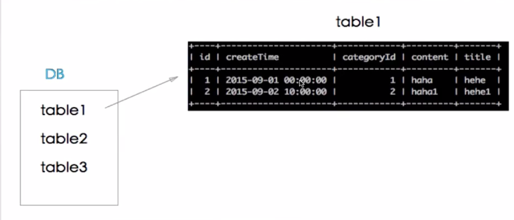

## 数据库的基本操作
查看当前DB: `show databases;`  
添加DB: `create database gc;`  
删除DB: `drop database gc;`

### 数据类型
数据库组成结构  


### 创建数据表
```
create table account(
  id bigint(20),
  createTime datetime,
  ip varchar(255),
  brief text,
  gender int(11),
)
```
### 删除数据表
```
drop table account;
```

### 给数据表添加或删除列
增加列：`alter table [table_name] add [column_name] [data_type] [not null] [default]`  
eg: `alter table account add c1 int(11) not null default 1;` (列不为空，且用1填充)

删除列：`alter table [table_name] drop 
[column_name]
`

### 修改某个数据列的名字或者数据类型
* 修改列信息
`alter table [table_name] change [old_column_name] [new_column_name] [data_type]`
如果只修改列的data_type，保持old & new column_name相同即可

* 修改表名
`alter table [table_name] rename [new_table_name]`  
eg: `alter table account rename newaccount;`

### 查看或者插入表数据
* 查看  
```
select * from table_name;
select col_1,col_2,... from table_name;
```

* 插入  
```
insert into [table_name] values(val_1,val_2...)
insert into [table_name] (col_1,col_2...) values(val_1,val_2)
```
eg:
```
insert into book values(1,'t hah','content');
insert into book(title) values('titile1');
```


